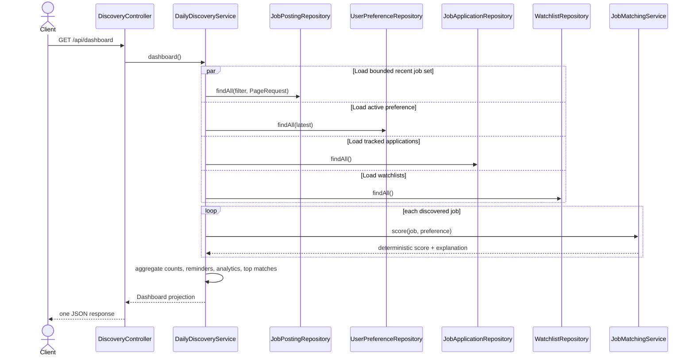
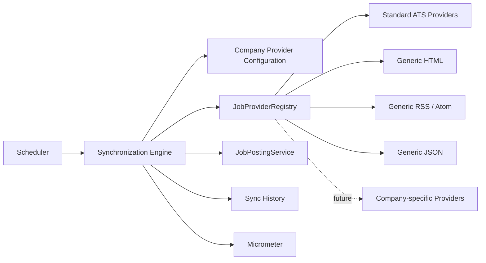
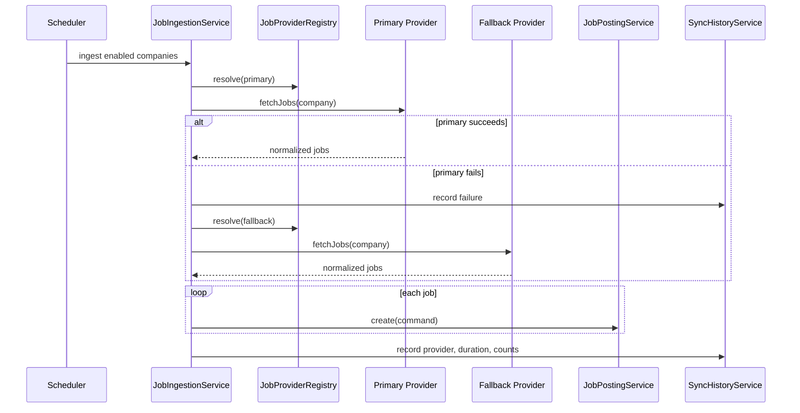
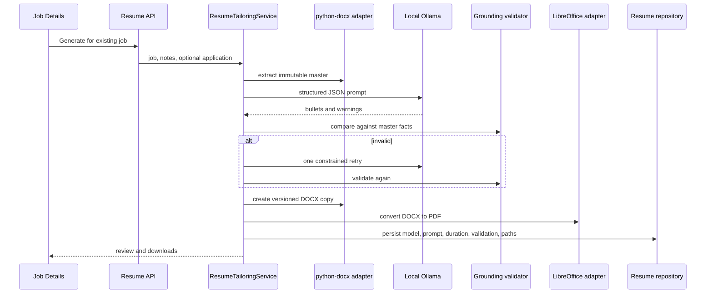
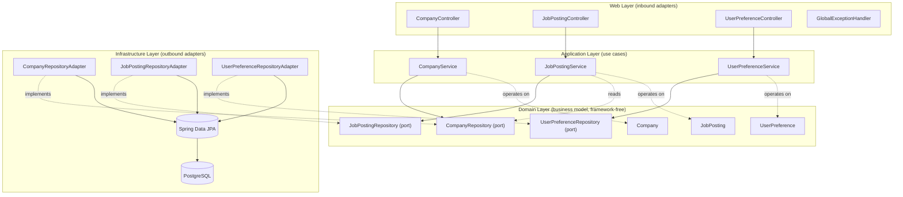
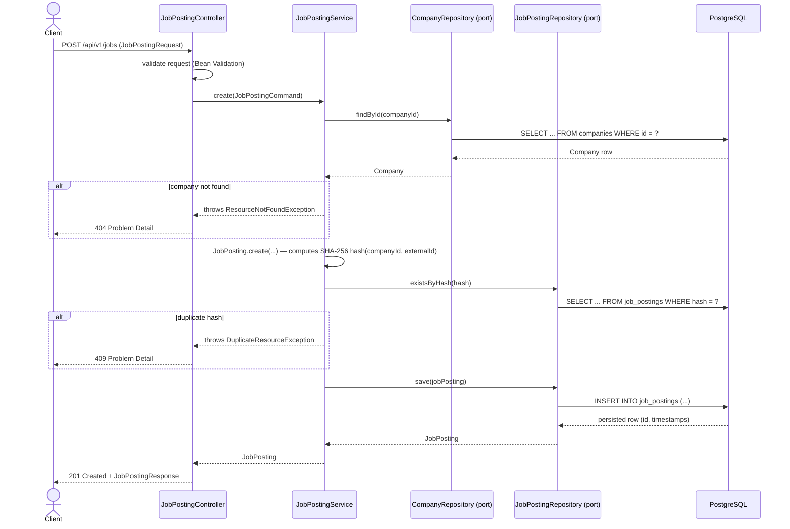
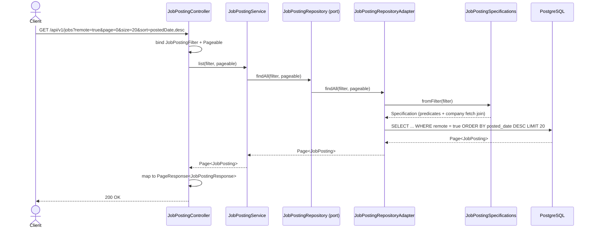
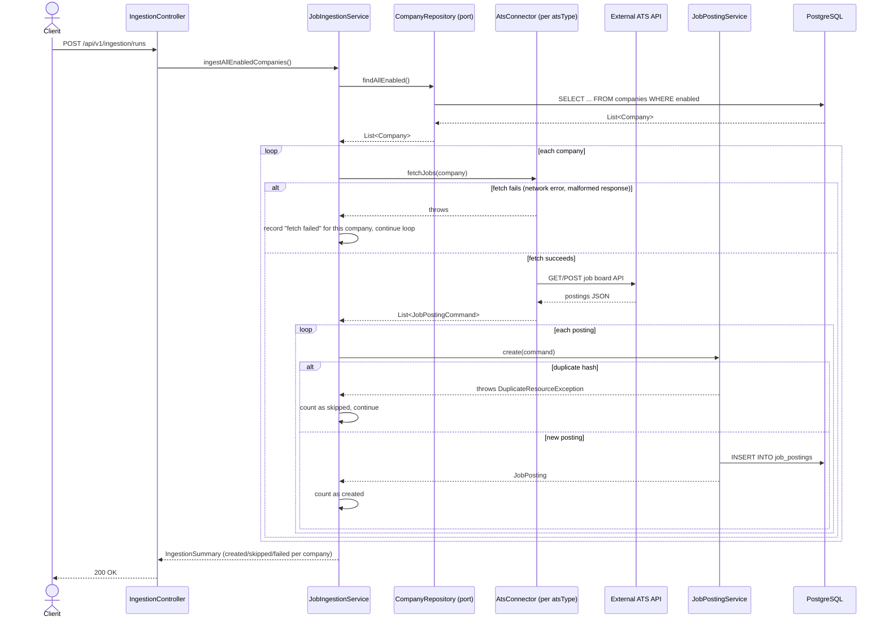

# CareerOS — Architecture (Milestones 1–3)

CareerOS is built as a **modular monolith** using **Hexagonal Architecture
(Ports & Adapters)**. Each business capability (company, job, preference) is
a self-contained module with its own domain, application, infrastructure,
and web layers. Modules communicate through public domain types, never
through infrastructure details.

## Milestone 3 discovery modules

Milestone 3 adds `matching`, `watchlist`, `application`, `search`, and
`discovery` modules. Mutable aggregates retain domain repository ports and
package-private Spring Data adapters. The `discovery` application service is
a read-model orchestrator: it reads through those ports, applies the pure
deterministic matcher, and returns endpoint-specific projections. Controllers
only validate/bind requests and map application results.

Matching weights live under `careeros.matching.weights`; startup fails when
they do not total 100. Scores are computed at read time so preference changes
take effect immediately and no stale denormalized score needs maintenance.

## Dashboard aggregation



The dashboard query is deliberately bounded to 500 recent postings. At a
larger data volume this port can be replaced by a database projection without
changing the controller or matching domain contract.

## Milestone 5 provider-based ingestion

Ingestion is resolved by capability rather than scheduler branches. Existing
ATS connectors and generic providers implement the same `JobProvider` port.
The registry discovers implementations and rejects duplicate registrations.





A successful provider—including a valid feed with zero current jobs—stops the
chain. Exceptions advance to the next fallback. Every actual attempt is stored
independently for health aggregation.

Provider lifecycle:

1. Implement `JobProvider` with a unique `ProviderType`.
2. Register the adapter as a Spring component.
3. Document and validate its JSON configuration.
4. The registry makes it available without scheduler changes.
5. Every synchronization emits history and Micrometer metrics.

## Milestone 6 local resume tailoring

Resume tailoring is a dedicated bounded module. `AIProvider`,
`ResumeDocumentPort`, and `PdfConverter` isolate Ollama, python-docx, and
LibreOffice from the application workflow. Prompt templates are versioned
classpath resources; their version is persisted with every artifact.



If the second validation fails, CareerOS uses the original extracted bullets.
PDF failure does not discard a valid DOCX. External processes use argument
arrays, bounded timeouts, captured output, and never invoke a shell. Resume
content is sent only to the configured local Ollama endpoint.

## Why hexagonal, and why a monolith first

The eventual system needs ATS connectors (Greenhouse, Lever, Ashby, Workday,
SmartRecruiters), a scoring engine, a resume-optimization AI pipeline, and a
recruiter CRM. Those are naturally pluggable adapters, not new services — a
Greenhouse connector is an inbound adapter that produces `JobPosting`
aggregates the same way the REST API's create endpoint does. Splitting into
microservices before the domain model has stabilized would mean distributed
transactions across boundaries that aren't proven yet. A modular monolith
with strict ports keeps deployment simple while making the eventual
extraction of a service (if ever needed) a matter of swapping an adapter,
not rewriting the domain.

## Layer diagram



**Dependency rule**: arrows only point inward. The domain layer imports
nothing from `application`, `web`, or `infrastructure`. The application
layer depends on domain *ports* (interfaces), never on
`infrastructure.persistence` classes — those are package-private and
invisible outside their module.

## Module layout

```
com.careeros
├── CareerOsApplication.java
├── config/                     # cross-cutting Spring configuration (OpenAPI, JPA auditing)
├── common/
│   ├── domain/                 # AuditableEntity (shared base, not a "god class")
│   ├── exception/               # ResourceNotFoundException, DuplicateResourceException, ...
│   └── web/                    # GlobalExceptionHandler, PageResponse<T>
├── company/
│   ├── domain/                 # Company, AtsType, Priority, CompanyRepository (port), CompanyFilter
│   ├── application/            # CompanyService, CompanyCommand
│   ├── infrastructure/persistence/  # Spring Data JPA repository + Specifications + adapter
│   └── web/                    # CompanyController, request/response DTOs, mapper
├── job/
│   ├── domain/                 # JobPosting, EmploymentType, SalaryRange, JobPostingRepository (port)
│   ├── application/            # JobPostingService, JobPostingCommand
│   ├── infrastructure/persistence/
│   └── web/
└── preference/
    ├── domain/                 # UserPreference, UserPreferenceRepository (port)
    ├── application/            # UserPreferenceService, UserPreferenceCommand
    ├── infrastructure/persistence/
    └── web/
```

The `job` module additionally hosts ATS ingestion (Milestone 2):

```
job/
├── application/
│   ├── JobPostingCommand.java, JobPostingService.java
│   └── ingestion/           # AtsConnector (port), JobIngestionService (orchestrator),
│                             # IngestionSummary, CompanyIngestionResult
├── infrastructure/
│   ├── persistence/          # unchanged
│   ├── ingestion/
│   │   ├── IngestionRestClientConfig.java   # RestClient.Builder bean
│   │   ├── support/          # AtsDateParser, EmploymentTypeParser, RemoteHeuristic
│   │   └── <ats>/            # greenhouse, lever, ashby, smartrecruiters, workday —
│   │                          # one package-private AtsConnector @Component + DTOs each
│   └── scheduling/
│       └── IngestionScheduler.java   # @Scheduled poller, gated by careeros.ingestion.enabled
└── web/
    ├── JobPostingController.java     # unchanged
    └── IngestionController.java      # manual trigger endpoints
```

The `AtsConnector` port lives in `job.application.ingestion`, not
`job.domain`, because it returns `JobPostingCommand` — an application-layer
type. `domain` must never import `application`, so a port depending on that
type can't live in `domain`.

Within each module, only `domain` types are public across module
boundaries. `infrastructure.persistence` classes (the Spring Data
repository interface and its adapter) are package-private — nothing outside
the module can accidentally depend on JPA specifics. `job` depends on
`company.domain` (a `JobPosting` belongs to a `Company`), which is the one
intentional cross-module dependency in milestone 1; `company` and
`preference` have no dependencies on sibling modules.

## Request flow: creating a job posting



The hash-based duplicate check is deliberately narrow for milestone 1: it
only catches an exact re-post of the same `(company, externalId)` pair. The
future **duplicate detection** feature (fuzzy/semantic matching across
re-postings, relisted roles, and near-duplicate titles) builds on top of
this — the hash stays as a cheap first-pass filter before anything more
expensive runs.

## Request flow: filtered, paginated listing



## Request flow: triggering ATS ingestion



One company's fetch failure never aborts the run for the others, and a
duplicate posting is an expected, counted outcome (not an error) — every
poll cycle re-fetches postings that were already ingested on a prior run.

## Cross-cutting concerns

- **Validation**: Jakarta Bean Validation on request DTOs (`@NotBlank`,
  `@Size`, `@Min`/`@Max`); domain invariants (e.g. `minimumScore` in
  [0, 100]) are additionally enforced inside the entity so they hold even
  for callers that bypass the web layer (future batch jobs, connectors).
- **Error handling**: every error response is an
  [RFC 7807](https://www.rfc-editor.org/rfc/rfc7807) `ProblemDetail` —
  `404` for missing resources, `409` for uniqueness violations, `400` for
  validation failures (with a field-level `errors` map), `500` for
  anything unexpected (logged, never leaked to the client).
- **Persistence**: no Hibernate `ddl-auto` — schema is owned entirely by
  Flyway migrations in `src/main/resources/db/migration`. IDs are
  DB-generated UUIDs (via Hibernate's `@UuidGenerator`), which avoids
  exposing sequential identifiers and works cleanly once the system needs
  to merge data from multiple ingestion sources.
- **Auditing**: `createdAt`/`updatedAt` are managed by Spring Data JPA
  auditing (`AuditableEntity`), never set manually — one less thing for
  every service method to get wrong.
- **Outbound HTTP (ATS ingestion)**: each connector uses Spring `RestClient`
  with connect/read timeouts from `IngestionProperties`
  (`careeros.ingestion.connect-timeout` / `read-timeout`). The `@Scheduled`
  poller is gated by `careeros.ingestion.enabled` (default `false`, via
  `@ConditionalOnProperty` so the trigger doesn't exist at all when
  disabled) — ingestion never fires unexpectedly in dev/test/CI.

## Known Hibernate 6 pitfalls this codebase already worked around

Worth documenting since they're easy to reintroduce:

1. **Lazy associations mapped to a DTO outside the transaction.**
   `open-in-view` is disabled (correct for production — it hides N+1s and
   holds connections open needlessly). That means any lazy association
   (`JobPosting.company`) accessed after the `@Transactional` service
   method returns throws `LazyInitializationException`. Fixed via
   `@EntityGraph` on `findById` and an explicit fetch-join `Specification`
   for list queries — not by flipping the association to `EAGER` globally
   or re-enabling `open-in-view`.
2. **An all-null `@Embeddable` deserializes as `null`, not an all-null
   instance.** When every column backing `SalaryRange` is `NULL`,
   Hibernate returns `null` for the field instead of `SalaryRange(null,
   null, null)`. `JobPosting.getSalary()` normalizes this at the domain
   boundary so no caller has to null-check it.
3. **`@Embeddable` Java records can silently misorder constructor
   arguments.** Hibernate 6 resolves embeddable attributes alphabetically
   by name but calls a record's canonical constructor positionally; if the
   record's declared field order isn't already alphabetical, values get
   passed into the wrong parameters (observed as a `ClassCastException`
   deep in `HibernateJpaDialect`, e.g. a `String` currency landing in a
   `BigDecimal` slot). `SalaryRange` is a plain class with an explicit
   constructor to sidestep that ordering assumption rather than rely on it.
4. **A batch orchestrator must not share a transaction with the per-item
   service it calls.** `JobPostingService.create()` is `@Transactional`
   (class-level, `REQUIRED` propagation). If `JobIngestionService` (which
   loops over postings calling `create()` and catches
   `DuplicateResourceException` per item) were itself `@Transactional`,
   every `create()` call in a run would join the *same* physical
   transaction — and Spring's AOP interceptor marks that transaction
   rollback-only on any unchecked exception raised by a participating
   method, even one caught immediately by the caller. The first duplicate
   anywhere in a run would silently poison the whole batch, surfacing only
   as `UnexpectedRollbackException` at commit time. `JobIngestionService` is
   deliberately **not** `@Transactional`, so each `create()` call is its own
   independent top-level transaction.

## Extension points for future milestones

| Future capability | Where it plugs in |
|---|---|
| Duplicate detection (fuzzy) | A new domain service consuming `JobPostingRepository`, layered on top of the existing hash check. |
| Job matching / scoring | A new `matching` module reading `UserPreference` + `JobPosting` through their existing ports; no changes needed to either aggregate. |
| AI resume optimization | A new module behind a `ResumeOptimizer` port, with an OpenAI-backed adapter — same pattern as persistence ports. |
| Recruiter CRM | A new bounded context (`recruiter/`) following the same domain/application/infrastructure/web shape. |
| Notifications, analytics | New outbound ports invoked from the application layer of the modules that produce the events (e.g. `JobPostingService.create` publishing a domain event once an event bus exists). |

None of this is implemented yet beyond milestones 1 and 2. The point of the
layering above is that none of it requires touching the `domain` or
`application` code that already exists — the ATS connectors added in
milestone 2 are the proof: they're new adapters and one new application
service, with zero changes to `Company`'s or `JobPosting`'s core domain
logic (`atsIdentifier` was an additive field, not a behavior change).
